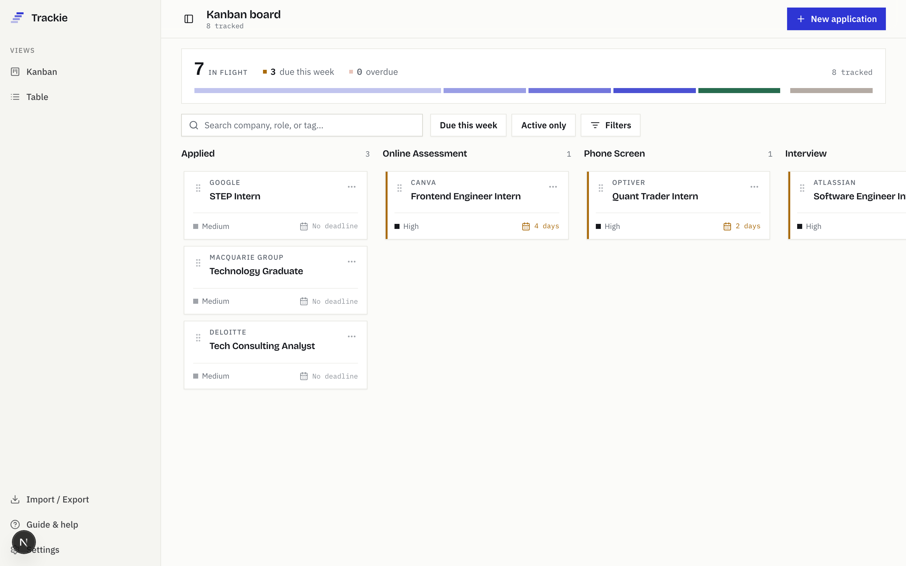

# Trackie

Trackie is a private, local-first workspace for managing job applications. There is no account, API or database: application data remains in the browser, persisted to `localStorage`.



## Tech stack

- **Framework** — [Next.js 16](https://nextjs.org) (App Router) on [React 19](https://react.dev), written in [TypeScript](https://www.typescriptlang.org).
- **Styling** — [Tailwind CSS v4](https://tailwindcss.com) via `@tailwindcss/postcss`, with shadcn-style primitives built on [Radix UI](https://www.radix-ui.com) (accordion, alert dialog, checkbox, dialog, dropdown menu, popover, scroll area, select, separator, slider, tabs, toggle group, tooltip).
- **Forms & validation** — [React Hook Form](https://react-hook-form.com) with [Zod](https://zod.dev) schemas via `@hookform/resolvers`.
- **Drag and drop** — [dnd-kit](https://dndkit.com) (`core`, `sortable`, `utilities`, `accessibility`) powers the kanban board.
- **UI utilities** — `lucide-react` icons, `class-variance-authority` and `tailwind-merge` for variant/class composition, `next-themes` for light/dark mode, `sonner` for toasts.
- **Import/export** — `papaparse` for CSV parsing.
- **Testing** — [Vitest](https://vitest.dev) with `@testing-library/react` and `jsdom` for unit/component tests, [Playwright](https://playwright.dev) for end-to-end tests.
- **Tooling** — ESLint (`eslint-config-next`) and `tsc --noEmit` for linting and type checking.

## Development

Requires Node.js 20.9 or later.

```bash
npm install
npm run dev
```

Open [http://localhost:3000](http://localhost:3000).

## Quality checks

```bash
npm run lint
npm run typecheck
npm test
npm run build
```

## Data compatibility

The rewrite continues to read and write the existing localStorage keys:

- `jobApplications`
- `darkMode`
- `viewMode`
- `filters`
- `sortBy`

Legacy records are normalised on load. Existing string IDs and unknown fields are retained, while new and imported records receive UUIDs. CSV, JSON and ICS formats remain compatible with the documented schema.

See [docs/DATA_SCHEMA.md](docs/DATA_SCHEMA.md) and [docs/EXPORT_IMPORT.md](docs/EXPORT_IMPORT.md) for details.
